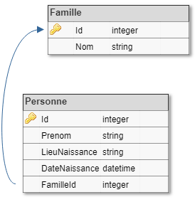
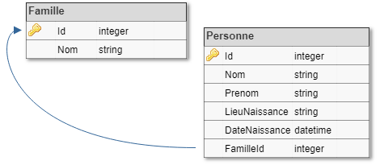

Queries
=======

Dans l'état actuel de notre système, il n'est possible que d'ajouter des familles et non pas de les lister, alors que le repository le permet (méthode ``GetAllFamillesAsync``). Pourtant, les données existent et ne demandent qu'à être consultées. Il s'agit de l'implémentation de la couche Query (pattern CQRS). L'idée principale derrière le CQRS est l'extrême performance en lecture, car un logiciel métier passe le plus clair de son temps à lire des données plutôt qu'à écrire.

Si notre logiciel est amené à évoluer vers une base de données, il faudra que cette base respecte le principe CQRS et soit une base optimisée pour la lecture. Dans le cas de notre exemple, en se focalisant sur les problématiques BDD, on imagine facilement une structure base de données comme cela :

Ce schéma de base de données normalisé est très optimisé pour la gain d'espace disque. Cependant, les principes de normalisation remonte à une époque où l'espace disque était plus cher et très rare. De nos jours, la tendance n'est plus la même, on a énormément d'espace disque, le point bloquant étant les ressources de calcul (CPU et RAM). On va donc "dénormaliser" la base de données, pour mettre le maximum de données à plat, afin d'éviter de trop solliciter les moteurs relationnels et gagner en temps de traitement. Notre schéma ressemblera donc à ceci :

La différence réside dans le fait que le nom de famille est dupliqué dans chaque ligne de la table personne, évitant ainsi d'avoir à faire une jointure sur la table Famille. Se pose dès lors la question de la nécessité d'une telle table. Avec une réflexion purement SQL, on se contenterait d'indexer la colonne 'Nom' et de faire un select distinct. Le problème, c'est que si cette opération est récurrente, on sera moins performant qu'un ``SELECT *``.

Cela est effectivement insignifiant au niveau de notre exemple, mais sur des données beaucoup plus massive, les gains de temps peuvent être énormes.

Bien évidemment, la mise à plat n'est pas toujours possible ou facile à concevoir, et il existera des situations où il faudra faire des jointures. L'idéal est de réduire au maximum les traitements à faire côté base de données, pour distribuer l'information le plus rapidement possible au contexte demandant.

Pour pouvoir gérer ces problématique, il va falloir que l'on mette en place une couche Query. Le but de cette couche Query est de créer des sources de données optimisées pour la lecture, de fournir une API pour les lires, et se charger de leur mise à jour. La couche Query doit renvoyer des ViewModels, des DTO (Data-Transfer-Object) qui restitue les données;

Il est important de passer par la case "DTO", afin d'avoir le formatage de données voulu, et d'éviter de renvoyer les objets de mappings/DAL. Cela peut amener à avoir plusieurs queries sur une même table, qui retourne chacune un petit bout uniquement, et c'est très bien comme cela. Encore une fois, on cherche à optimiser les lectures, on procèdera donc à la mise en cache et tout autre sorte de mécanisme pour gagner en performance.

Alors que précédemment on utilisait directement notre repository pour lire la liste des familles, on passera dorénavant par une query. Le but des query est d'encapsuler totalement le repository et les accès aux données pour les optimiser (et ne plus laisser cette responsabilité à l'appelant) ::    

    public class FamilleListItem
    {
        public string Nom { get; internal set; }
    
        internal FamilleListItem() { }    
    }

::

    public interface IRecupererListeFamille : IQuery<IEnumerable<FamilleListItem>> { }
    class RecupererListeFamille : IRecupererListeFamille, IAutoRegisterType
    {
    
        private static ConcurrentBag<string> s_Cache
            = new ConcurrentBag<string>();
    
        private readonly IFamilleRepository _familleRepository;
    
        public RecupererListeFamille(IFamilleRepository familleRepository)
        {
            _familleRepository = familleRepository ?? throw new ArgumentNullException(nameof(familleRepository));
        }
    
        public async Task<IEnumerable<FamilleListItem>> ExecuteQueryAsync()
        {
            if (s_Cache.IsEmpty)
            {
                var allFamilles = (await _familleRepository.GetAllFamillesAsync().ConfigureAwait(false)).Select(f => f.Nom);
            }
            return s_Cache.Select(v => new FamilleListItem { Nom = v });
        }
    }
        
On déclare une interface publique de typage fort qui déclare les entrées/sorties de la query, pour respecter le dernier principe SOLID. Nous avons également choisi l'impémentation internal, encore une fois pour éviter les erreurs de développements qui prendrait le raccourci de travailler avec l'implémentation plutôt que l'abstraction. Cela permettra à notre système de faire évoluer les bases de lecture de façon indolore.

Dorénavant, pour liste les familles, on passera par ``IRecupererListeFamille`` au lieu d'utiliser le repository.

.. note:: Il est même recommandé de passer en internal toute le contenu de la couche persistance et d'autoriser uniquement la couche Query à les voir depuis l'extérieur (avec InternalsVisibleTo).
Il reste cependant un problème avec cet exemple : si l'on ajoute une nouvelle famille dans le système, il est nécessaire de le redémarrer pour la voir apparaître car le cache prends le pas sur la lecture. Il faut donc procéder à l'invalidation à la base d'événements. Dans notre cas, on a deux possibilité : mettre à jour le cache ou l'invalider. Le plus simple est l'ajout ::

    class FamilleCreeeInvalider : IDomainEventHandler<FamilleCreee>
    {
        public Task HandleAsync(FamilleCreee domainEvent, IEventContext context = null)
        {
            RecupererListeFamille.AjouterFamilleAuCache(domainEvent.NomFamille.Value);
            return Task.CompletedTask;
        }
    }
    public interface IRecupererListeFamille : IQuery<IEnumerable<FamilleListItem>> { }
    class RecupererListeFamille : IRecupererListeFamille
    {
            internal static void AjouterFamilleAuCache(string nom) => s_Cache.Add(nom);
    
        private static ConcurrentBag<string> s_Cache
            = new ConcurrentBag<string>();
    
        private readonly IFamilleRepository _familleRepository;
    
        public RecupererListeFamille(IFamilleRepository familleRepository)
        {
            _familleRepository = familleRepository ?? throw new ArgumentNullException(nameof(familleRepository));
        }
    
        public async Task<IEnumerable<FamilleListItem>> ExecuteQueryAsync()
        {
            if (s_Cache.IsEmpty)
            {
                var allFamilles = (await _familleRepository.GetAllFamillesAsync().ConfigureAwait(false)).Select(f => f.Nom);
            }
            return s_Cache.Select(v => new FamilleListItem { Nom = v });
        }
    }
	
A titre d'exercice, vous pouvez créer les queries de récupération des personnes, et même éventuellement rajouter des paramètres (par exemple une date de naissance minimale, ou juste ceux qui sont vivants). Le nombre de queries importe peu et doit répondre aux cas métiers. De la même façon, au lieu d'essayer de toujours essayer de fonctionner avec le cas existant, considérez également la création de table/vue pour optimiser vos traitements.