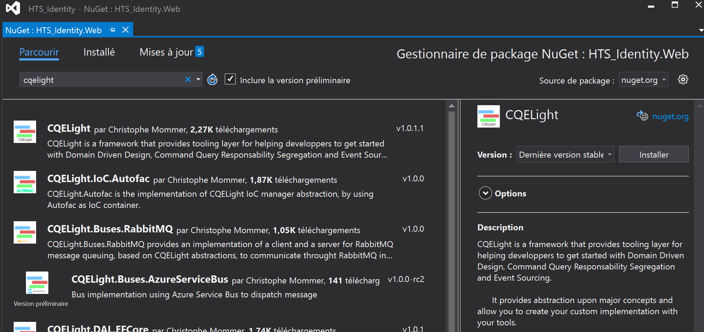

Getting started
===============
Le test du Hello World! (event sourcé, évidemment ...)
^^^^^^^^^^^^^^^^^^^^^^^^^^^^^^^^^^^^^^^^^^^^^^^^^^^^^^	
Tout d'abord, il faut savoir qu'il y a des exemples disponibles sur notre `repository GitHub, ici-même <https://github.com/cdie/CQELight/tree/master/samples>`_
. Autre chose à savoir également, CQELight est `distribué en packages NuGet modulaires <https://www.nuget.org/packages?q=cqelight>`_, en .NET Standard 2.0.

Afin de l'installer, il faut commencer par créer un nouveau projet console (idéalement .NET Core, sinon, si vous voulez le faire en .NET Framework, la version minimale est la 4.6.1) sous Visual Studio (ou l'éditeur de votre choix), et ensuite faire une recherche de package sur CQELight. Plusieurs résultats devraient apparaitre. Installer le package 'CQELight'.

.. note:: La dernière version stable peut avoir changé depuis la rédaction de cette documentation. Il est conseillé de prendre toujours la dernière version stable pour avoir les dernières fonctionnalités et corrections de bugs.

**Félicitations !** Vous venez d'installer CQELight sur un projet, nous pouvons dorénavant commencer à l'utiliser.

Créons maintenant deux nouveaux dossiers : '*Events*' et '*Handlers*'. Créons également deux nouvelles classes : '*GreetingsEvent*' (dans le dossier Events) et '*GreetingsEventHandler*' (dans le dossier *Handlers*). Nous sommes prêt pour faire la configuration.

Il faut maintenant que dès lors que le système reçoit un event de type GreetingsEvent, le message 'Hello World!' s'affiche sur la console. Faisons devenir notre GreetingsEvent un VRAI event ::

    using CQELight.Abstractions.Events;
    class GreetingsEvent : BaseDomainEvent
    {
    }

Ensuite, faisons devenir GreetingsEventHandler un **VRAI** EventHandler, avec le comportement désiré ::

    using ConsoleApp1.Events;
    using CQELight.Abstractions.Events.Interfaces;
    using System;
    using System.Threading.Tasks;
    class GreetingsEventHandler : IDomainEventHandler
    {
        public Task HandleAsync(
			GreetingsEvent domainEvent, 
			IEventContext context = null)
        {
            Console.WriteLine("Hello world!");
            return Task.CompletedTask;
        }
    }    

Maintenant, il est nécessaire de déclencher le mécanisme depuis le thread du programme. Pour ce faire, il faut envoyer l'événement dans le système. Etant donné que l'on fonctionne 100% In-Memory, il faut ajouter le package *CQELight.Buses.InMemory*.

Une fois fait, il faut configurer le système et envoyer l'événement ::

    using CQELight;
    using CQELight.Dispatcher;
    using HelloWorld.Events;
    using System;
    using System.Threading.Tasks;
    
    namespace HelloWorld
    {
        class Program
        {
            static async Task Main(string[] args)
            {
                new Bootstrapper()
                    .UseInMemoryEventBus()
                    .Bootstrapp();
    
                await CoreDispatcher.PublishEventAsync(new GreetingsEvent());
    
                Console.Read();
            }
        }
    }
     
.. note:: Dans cet exemple, nous utilisons une version de Visual Studio permettant l'usage de C# 7.3, qui permet d'avoir une méthode Main d'une application console qui soit asynchrone. Si ce n'était pas votre cas, faites un appel avec *CoreDispatcher.PublishEventAsync().GetAwaiter().GetResult()* pour un résultat similaire.

Lancez le programme et voilà, vous avez publié votre premier event ! Il reste encore beaucoup de choses à découvrir avec CQELight, ceci n'est qu'un petit avant goût des possibilités offertes. Explorez les parties qui vous intéressent par le menu, ou jetez un coup d'oeil à notre repository pour savoir ce qui arrive.

Le code source de cet exemple est disponible à cette adresse.